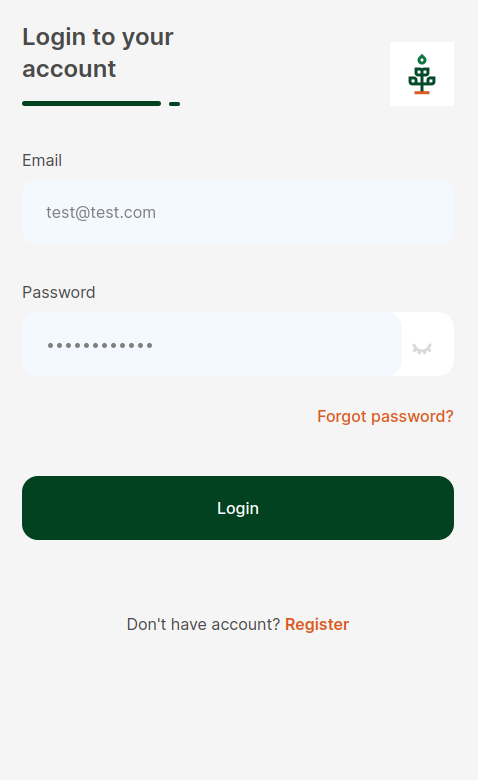
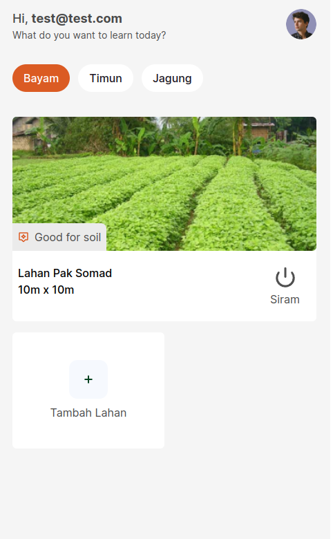
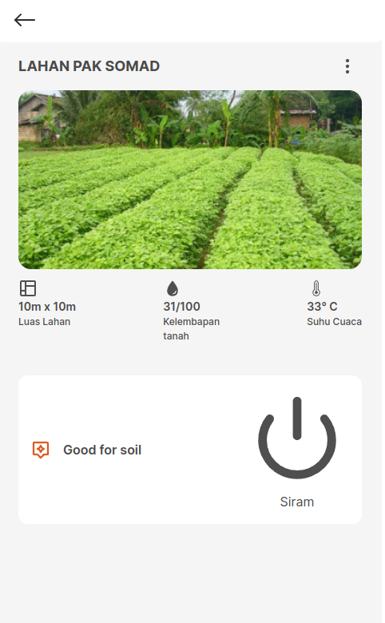

# Smartani

<p float="left">
  
  
  
</p>

## Description

Smartani adalah aplikasi inovatif yang dirancang khusus untuk memudahkan pengelolaan lahan pertanian dan mengoptimalkan proses pertanian melalui otomatisasi. Dengan kombinasi teknologi canggih dan kecerdasan buatan, Smartani memberikan solusi yang efisien dan efektif bagi para petani modern.

## Getting Started

### Dependencies

- Describe any prerequisites, libraries, OS version, etc., needed before installing program.
- node version 16.19.0
- npm vesion 8.19.3

### Deploying

- https://smartani.netlify.app

### Executing program

- How to run the program

```
   clone this project
```

```
   npm install
```

```
   npm run dev (for development)
```

```
   npm run build (for production)
```

## Authors

Contributors names and contact info

[@Osenbal](https://github.com/osenbal)
Alan
Septian
Joko

## Version History

- 0.1
  - Initial Release
